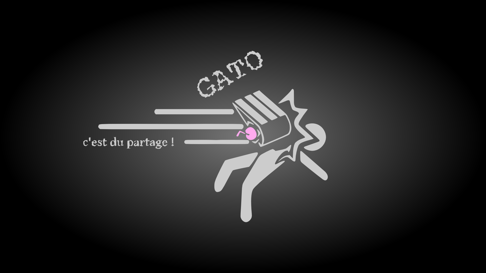

# logstalgia - web server access log visualizer

```
tail -f /var/log/apache2/access.log | logstation -f -
```


# GraphQL

 * https://graphql-explorer.githubapp.com/

# fond d'ecran


v0.2


# unicode script

Un script shell pour récuperer des caractères unicode en connaissance leur nom.

 * Voir [sh-unicode](https://github.com/tst2005/sh-unicode)

Exemple:
```
./bin/unicode search CAT
./bin/unicode search CAT\ FACE
./bin/unicode getall CAT\ FACE

./bin/unicode getall DIVISION

$ touch -- 'a∕b'
$ ls -l 
$ rm -- a?b

./bin/unicode rawsearch DOG
./bin/unicode search DOG\ FACE
./bin/unicode getall DOG\ FACE
```

 * https://github.com/tst2005/sh-unicode#cats
 * http://www.iemoji.com/view/emoji/832/people/cat-face-with-wry-smile

# lean x in y minutes

Un site pour appprendre pleins de languages de programmation : [learnxinyminutes.com](https://learnxinyminutes.com/)


# tmux detaching...

Comment détacher un client connecté a la meme session.
(probleme de resolution differente entre les clients)

```
^B:ls
^B:lsc
^B:detach-client -t /dev/pts/xx
```

# screen detaching...

```
screen -dr
```


# bats - bash automated tests

* [bats sur github](https://github.com/sstephenson/bats)


# des couleurs

* Les couleurs nommées : [dans X11](https://en.wikipedia.org/wiki/X11_color_names) ; [dans SVG](https://www.w3.org/TR/SVG/types.html#ColorKeywords)
* Un site sympa pour jouer avec la couleur : [colorizer.org/](http://colorizer.org/)

